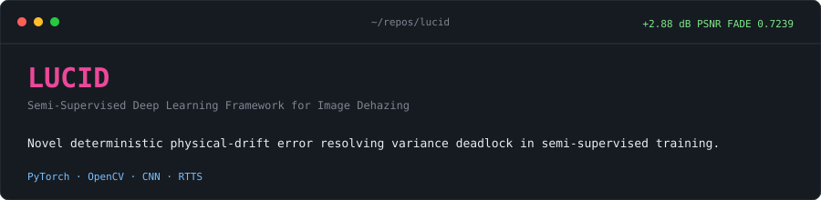
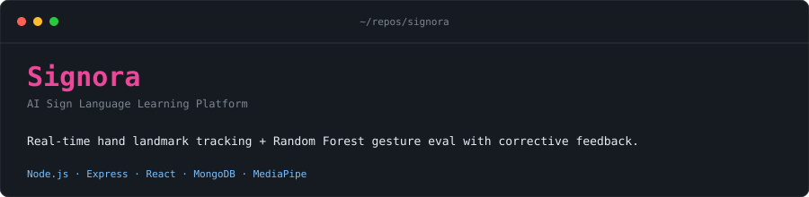
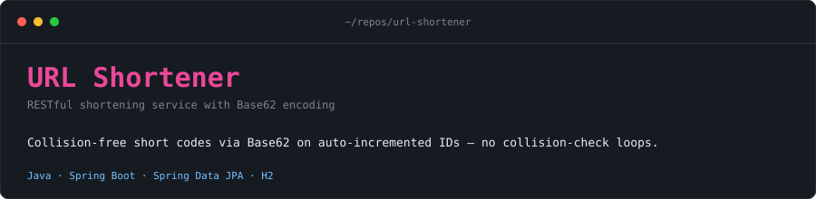
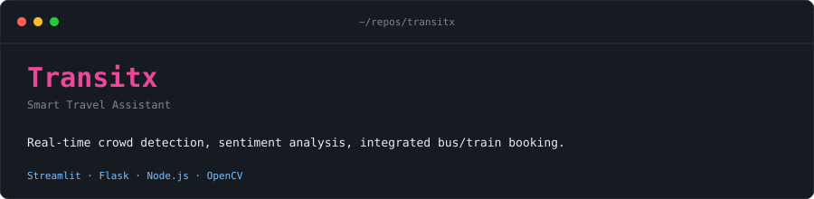

  
  &nbsp;
  
  &nbsp;
  
  &nbsp;
  

**Akshay S** · `Akshay-S-31`
**CSE (Honors)** at TKM College of Engineering, Kerala · graduating **May 2027**
Alappuzha, IN

Deep learning research and Java backends, in parallel. Chasing the intersection: ML systems that actually ship and stay up. Currently building **LUCID** — a semi-supervised dehazing framework that resolved a variance deadlock in its own architecture and beat baselines by **+2.88 dB PSNR** with an industry-competitive **FADE score of 0.7239**.

### ML Intern · Susaanoo Systems
`May 2026 — July 2026` · Remote

Architected a **hybrid spatial-temporal deep learning engine** for cross-asset crypto forecasting (BTC, ETH, SOL) that stitched three things most models keep separate:

- **Variable Selection Network (VSN)** + multi-head **Graph Neural Networks** — joint cross-asset dependencies without sequence flattening
- **Mamba-3 MIMO State Space Model** — temporal dynamics at scale
- **Cost-aware dual-head loss** — enforced monotonic quantile intervals while classifying 3-class directional targets bounded by a 0.1% exchange-fee threshold across 15m / 1h / 4h horizons

Ran under **strict 5-fold chronological walk-forward validation** on order-book microstructure data. Outperformed Gradient Boosted Tree baselines with **0.668 out-of-sample ROC-AUC** and **48.8% actionable win-rate** on non-neutral trading signals.

| domain | tools |
|---|---|
| **languages** | Java · Python · JavaScript · SQL · HTML/CSS |
| **deep learning** | PyTorch · scikit-learn · OpenCV |
| **backend** | Spring Boot · Node.js · Express |
| **databases** | PostgreSQL · MySQL · MongoDB |
| **infra & tools** | AWS · Linux · Git · GitHub |

**Certifications** — AWS Cloud Technical Essentials · NPTEL Programming, DS & Algorithms *(IIT Madras)* · IBM SkillsBuild: AI Agent Architect

